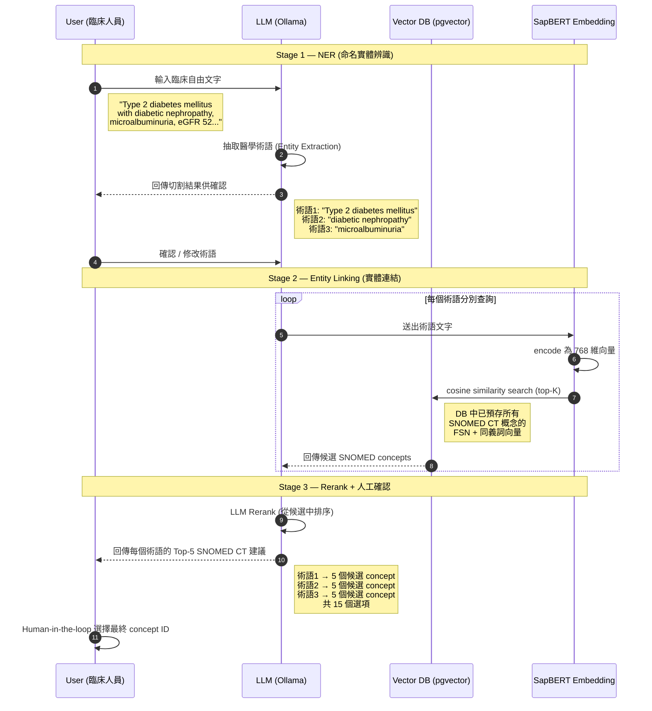

# Medical Terminology Standardization System

醫療術語標準化系統 — 整合多種國際醫學代碼系統，提供向量語意搜尋與代碼對應服務。

## 系統架構

| 元件 | 技術 |
|---|---|
| Framework | FastAPI |
| Database | PostgreSQL 16 + pgvector |
| Embedding | Sentence Transformers |
| LLM | Ollama (gpt-oss:20b) |
| ORM | SQLAlchemy 2.0 |

---

## 代碼系統總覽

### SNOMED CT (Systematized Nomenclature of Medicine)

- **用途**：診斷、處置、發現等臨床概念的標準術語
- **資料來源**：SNOMED International RF2 格式（2025 年 7 月版）
- **資料庫**：`rag_v2_db` — `documents` + `document_embeddings` 表
- **Embedding 模型**：`cambridgeltl/SapBERT-from-PubMedBERT-fulltext`
- **功能**：
  - 向量語意搜尋（FSN + 同義詞）
  - NER 命名實體辨識（LLM 抽取臨床術語）
  - LLM Reranking
  - SNOMED CT → ICD-10 交叉對應

### ICD-10 PCS (Procedure Coding System)

- **用途**：手術/處置編碼（7 碼結構：Body System + Root Operation + Body Part + Approach + Device + Qualifier）
- **資料來源**：CMS 官方資料 + 健保署中文翻譯
- **資料庫**：`icd10_pcs_db` — `codespcs` + `embed_icd10` 表
- **Embedding 模型**：
  - 英文：`sentence-transformers/all-mpnet-base-v2`
  - 中文：`sentence-transformers/paraphrase-multilingual-mpnet-base-v2`
- **功能**：
  - 中英文自動偵測，各自使用對應模型與向量欄位
  - 住院碼 / 門診碼分開管理
  - LLM 解釋搜尋結果

### RxNorm (Drug Terminology)

- **用途**：藥品成分、臨床藥品、品牌藥品的標準代碼
- **資料來源**：NLM RxNav REST API（即時查詢，無本地資料庫）
- **核心概念**：RxCUI（RxConcept Unique Identifier）
- **TTY 分類**：IN（成分）、SCD（臨床藥品）、SBD（品牌藥品）、DF（劑型）等
- **功能**：
  - 多策略查詢（精確 → 模糊 → 字串比對）
  - 成分 → 劑型 → 品牌 關聯查詢
  - NDC 碼對應
  - 拼字建議

### LOINC (Logical Observation Identifiers Names and Codes)

- **用途**：檢驗/檢查結果的標準代碼
- **資料庫**：`loinc_db` — `loinc_mapping` 表（52,879 筆，536 個健保碼 → 24,347 個 LOINC code）
- **資料來源**：
  - `reference/NHI-Code–LOINC對應清單.xlsx` — 醫療資訊大平台（主要，503 個健保碼，含 6 軸）
  - `reference/ConceptMap-nhi-loinc.json` — 衛福部 FHIR 值集（補充，53 個健保碼，台灣特有健保給付項目）
  - `reference/Loinc.csv` — LOINC 官方資料庫（10 萬筆，用來補衛福部缺少的 6 軸）
- **設計決策**：LOINC 本質是結構化查表（6 軸篩選），不適合 RAG 向量搜尋，因此不建立 embedding，改用 SQL 精確查詢

#### LOINC 6 軸結構說明

每個 LOINC code 由 6 個維度組合而成，以血清肌酸酐（`2160-0`）為例：

| 軸 | 英文名 | 說明 | 範例值 |
|---|---|---|---|
| 1 | Component | 檢測的物質/分析物 | Creatinine |
| 2 | Property | 量測的性質（濃度、比率、數量等） | MCnc（質量濃度） |
| 3 | Time | 時間點（Pt）或時間段（24H） | Pt（某一時間點） |
| 4 | System | 檢體來源 | Ser/Plas（血清/血漿） |
| 5 | Scale | 量測尺度 | Qn（定量） |
| 6 | Method | 檢測方法（可選） | — |

#### 使用流程與自動化策略

醫院檢驗資料量龐大（數千萬甚至億筆），不可能逐筆人工選擇 LOINC code。設計為兩階段：

**第一階段：建立院內對照表（一次性，需醫檢師參與）**

1. 前端呼叫 `/loinc/lookup` 取得該健保碼的所有 LOINC 候選（含 6 軸）
2. 醫檢師透過 6 軸階層式篩選，選定該院該項目對應的 LOINC code
3. 選定結果存入「院內對照表」

> 若某健保碼在對照表中只有**一種高度相關（relation=H）的 LOINC**，系統可自動帶入，不需人工選擇，進一步減輕醫檢師負擔。

**第二階段：批次自動轉換（日常，全自動）**

後續所有檢驗資料只要帶有健保碼，即可查詢院內對照表自動填入 LOINC code，無需人工介入。

> **重要：導入前務必與醫院方確認以下事項**
> 1. 同一健保碼是否存在**多種檢測方法**（例如不同設備、不同試劑），導致對應不同的 LOINC code
> 2. 歷史資料中是否有**設備汰換紀錄**，舊設備與新設備的檢測方法可能不同，需以時間區間區分
> 3. 是否有**院區差異**（例如總院與分院使用不同儀器），同一健保碼在不同院區可能對應不同 LOINC
> 4. 若以上情況存在，院內對照表需擴充為「健保碼 + 條件（時間/院區/設備）→ LOINC code」，而非單純的一對一 mapping
>
> **未確認這些條件就直接建立一對一對照表，會導致歷史資料的 LOINC 標註錯誤。**

#### 輸入資料公版格式

為統一各醫院提供的檢驗項目資料，定義以下輸入格式：

| 欄位 | 必填 | 說明 | 填寫者 |
|---|---|---|---|
| `hospital_code` | 是 | 院內碼（各醫院自訂） | 醫院 |
| `nhi_code` | 是 | 健保碼（全國統一） | 醫院 |
| `test_name_cht` | 是 | 檢驗項目中文名稱 | 醫院 |
| `test_name_eng` | 是 | 檢驗項目英文名稱 | 醫院 |
| `specimen_type` | 是 | 檢體種類（血液/尿液/體液等） | 醫院 |
| `component` | 否 | LOINC 軸 1 — 分析物 | 系統/醫檢師 |
| `property` | 否 | LOINC 軸 2 — 量測性質 | 系統/醫檢師 |
| `time_aspect` | 否 | LOINC 軸 3 — 時間 | 系統/醫檢師 |
| `system` | 否 | LOINC 軸 4 — 檢體來源 | 系統/醫檢師 |
| `scale` | 否 | LOINC 軸 5 — 尺度 | 系統/醫檢師 |
| `method` | 否 | LOINC 軸 6 — 方法 | 系統/醫檢師 |
| `unit` | 否 | 單位（mg/dL 等） | 醫院 |
| `loinc_code` | 否 | 對應的 LOINC code（輸出） | 系統/人工確認 |
| `notes` | 否 | 備註 | 任何人 |

> **設計原則**：醫院只需填前 5 欄（院內碼、健保碼、中英文名稱、檢體），LOINC 6 軸由系統從對照表自動帶入或醫檢師審核補上，最終 `loinc_code` 由程式 mapping + 人工確認產出。

---

## API 端點

### SNOMED CT `/api/v1/snomed/`

| 端點 | 方法 | 說明 |
|---|---|---|
| `/search` | POST | 向量語意搜尋 SNOMED CT 概念 |
| `/identify` | POST | 臨床文字 NER + 搜尋 + Rerank |
| `/stats` | GET | 知識庫統計 |

### ICD-10 PCS `/api/v1/icd10/`

| 端點 | 方法 | 說明 |
|---|---|---|
| `/search` | POST | 向量搜尋（自動偵測中英文） |
| `/explain` | POST | 搜尋 + LLM 解釋 |
| `/stats` | GET | 知識庫統計 |

### RxNorm `/api/v1/rxnorm/`

| 端點 | 方法 | 說明 |
|---|---|---|
| `/lookup` | POST | 多策略成分查詢 |
| `/approximate` | POST | 模糊藥名比對 |
| `/drugs` | POST | 成分的所有相關藥品 |
| `/related` | POST | 完整關聯樹（成分、劑型、品牌） |
| `/{rxcui}/properties` | GET | RxCUI 基本屬性 |
| `/{rxcui}/ndcs` | GET | NDC 碼查詢 |
| `/spelling/{name}` | GET | 拼字建議 |

### LOINC `/api/v1/loinc/`

| 端點 | 方法 | 說明 |
|---|---|---|
| `/lookup` | POST | 健保碼 → 所有 LOINC 候選（含 6 軸，供前端階層篩選） |
| `/resolve` | POST | 健保碼 + 6 軸條件 → 精確篩選 LOINC code |
| `/stats` | GET | 知識庫統計 |

---

## 專案結構

```
/data/snomedCT/
├── app/                              # FastAPI 應用程式
│   ├── config.py                     # 環境變數設定
│   ├── database.py                   # 多資料庫 engine & session
│   ├── embedding.py                  # EmbeddingService
│   ├── llm.py                        # LLMService (Ollama)
│   ├── rag.py                        # 通用 RAGService
│   ├── main.py                       # FastAPI app + 路由註冊
│   ├── snomed/                       # SNOMED CT 模組
│   │   ├── models.py / schemas.py / routers.py
│   ├── icd10/                        # ICD-10 PCS 模組
│   │   ├── models.py / schemas.py / routers.py
│   └── rxnorm/                       # RxNorm 模組
│       ├── rxnorm_service.py / models.py / schemas.py / routers.py
│
├── script/                           # 資料處理腳本
│   ├── snomed/                       # SNOMED CT 資料建置
│   ├── icd10/                        # ICD-10 embedding 建置
│   │   ├── build_embed_eng.py        # 英文向量（all-mpnet-base-v2）
│   │   └── build_embed_chn.py        # 中文向量（multilingual-mpnet）
│   ├── rxnorm/                       # RxNorm 資料解析
│   └── loinc/                        # LOINC 開發中
│
├── data/                             # 原始資料
│   ├── SnomedCT_International.../    # SNOMED CT RF2 原始檔
│   ├── loinc-data/                   # LOINC 檢驗項目資料
│   └── zip-file-2-2026.../           # CMS ICD-10 PCS 2026 資料包
│
├── reference/                        # 跨服務關聯資料
│   └── ConceptMap-nhi-loinc.json     # 衛福部健保碼→LOINC 對照表
│
├── .env                              # 環境設定
├── run.py                            # 啟動入口
└── requirements.txt                  # Python 套件
```

---

## 核心服務元件

### RAGService (`app/rag.py`)
通用的檢索增強生成服務，支援：
- 向量相似度搜尋（可配置 SQL、DB session、result mapper）
- NER 命名實體辨識（LLM 抽取醫學術語）
- LLM Reranking（候選結果重排序）
- 結果分群（同一 concept_id 取最高相似度）

### EmbeddingService (`app/embedding.py`)
- 支援多種 Sentence Transformer 模型
- 批次 embedding（含進度條）
- 正規化向量（cosine similarity ready）

### LLMService (`app/llm.py`)
Ollama 介面，支援：
- 長文本分段 NER（自動切割 + 去重）
- 搜尋結果 Reranking
- 結果解釋生成

---

## 資料流程



---

## 環境設定

```bash
# .env 主要參數
POSTGRES_HOST=localhost
POSTGRES_PORT=5432
POSTGRES_DB=rag_v2_db          # SNOMED CT
ICD10_POSTGRES_DB=icd10_pcs_db # ICD-10 PCS
OLLAMA_IP=172.16.2.113
OLLAMA_MODEL=gpt-oss:20b
NLM_URL=https://rxnav.nlm.nih.gov/
```

### 啟動服務

```bash
source snomed-venv/bin/activate
python run.py --host 0.0.0.0 --port 8000
```

API 文件：`http://<host>:8000/docs`（需帳密）

---

## 參考資源

| 資源 | 網址 |
|---|---|
| SNOMED CT Browser | https://browser.ihtsdotools.org/ |
| CMS ICD-10-PCS | https://www.cms.gov/medicare/coding-billing/icd-10-codes |
| NLM RxNav API | https://loinc.nlm.nih.gov/rxnav/ |
| LOINC Search | https://loinc.org/search/ |
| TW Core IG（衛福部 FHIR） | https://twcore.mohw.gov.tw/ig/twcore/index.html |
| 衛福部健保碼→LOINC 對照 | https://build.fhir.org/ig/TWNHIFHIR/pas/ConceptMap-nhi-loinc.html |

---

## 基礎建設

<details>
<summary>Ubuntu 資料碟設定與 PostgreSQL 安裝（點擊展開）</summary>

### 系統環境
- OS: Ubuntu 24.04
- 系統碟: 50GB (`/dev/sda`)
- 資料碟: 100GB (`/dev/sdb`)
- PostgreSQL 版本: 16.11

### 資料碟分割與掛載

```bash
# 分割
sudo fdisk /dev/sdb  # n → p → 1 → Enter → Enter → w

# 格式化
sudo mkfs.ext4 /dev/sdb1

# 掛載
sudo mkdir -p /data
sudo mount /dev/sdb1 /data
sudo chown hoone:hoone /data

# 開機自動掛載（編輯 /etc/fstab）
UUID=a4c74858-bc1f-4de6-8d66-c225de1f1fa7  /data  ext4  defaults  0  2
```

### PostgreSQL 安裝與資料目錄遷移

```bash
# 安裝
sudo apt install postgresql postgresql-contrib -y

# 遷移資料目錄到資料碟
sudo systemctl stop postgresql
sudo rsync -av /var/lib/postgresql/ /data/postgresql/
sudo mv /var/lib/postgresql /var/lib/postgresql.backup

# 修改 postgresql.conf
data_directory = '/data/postgresql/16/main'

# 啟動
sudo systemctl start postgresql
```

### 目前系統配置

| 磁碟 | 內容 | 使用量 |
|---|---|---|
| 系統碟 (47G) | Ubuntu + PostgreSQL 程式 | ~13G |
| 資料碟 (98G) | `/data/snomedCT` + `/data/postgresql` | ~5.8G |

符號連結：`/home/hoone/snomedCT` → `/data/snomedCT`

### 常用指令

```bash
# PostgreSQL 服務
sudo systemctl start/stop/restart/status postgresql

# 連線
sudo -u postgres psql -d database_name

# 備份
sudo -u postgres pg_dump database_name | gzip > backup.sql.gz

# 磁碟空間
df -h | grep data
sudo du -h --max-depth=1 /data | sort -hr
```

### 疑難排解

```bash
# PostgreSQL 無法啟動
sudo tail -50 /var/log/postgresql/postgresql-16-main.log
sudo chown -R postgres:postgres /data/postgresql
sudo chmod 700 /data/postgresql/16/main

# 資料碟未掛載
sudo mount -a
dmesg | tail
```

</details>

---

**最後更新**: 2026-03-30
**作者**: hoone
