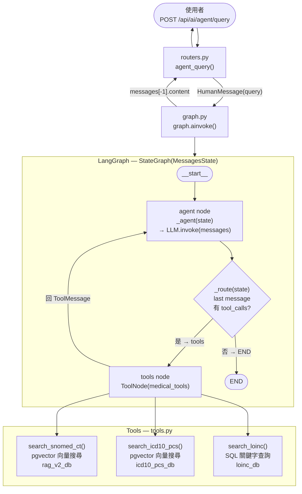

# Medical Coding Agent

## 整體架構



---

## Graph 寫法對照

`graph.py` 用 **method chaining** 一次串完整個 graph：

```python
# graph.py 第 54–62 行
graph = (
    StateGraph(MessagesState)          # 1. 建立 graph，state 型別為 MessagesState
    .add_node("agent", _agent)         # 2. 加入 agent 節點（LLM 思考）
    .add_node("tools", ToolNode(...))  # 3. 加入 tools 節點（執行工具）
    .add_edge("__start__", "agent")    # 4. 固定邊：起點 → agent
    .add_conditional_edges(            # 5. 條件邊：agent → ? 由 _route 決定
        "agent",
        _route,
        {"tools": "tools", END: END}   # 對應表：_route 回傳值 → 下一節點
    )
    .add_edge("tools", "agent")        # 6. 固定邊：tools 執行完 → 回 agent
    .compile()                         # 7. 編譯成可執行 graph
)
```

| 方法 | 作用 |
|---|---|
| `StateGraph(MessagesState)` | 宣告 state 結構，這裡用內建的 `MessagesState`（只有 `messages: list` 欄位） |
| `add_node(name, fn)` | 加入節點，`fn` 接收 state、回傳 state 的 partial update |
| `add_edge(a, b)` | 無條件邊，執行完 `a` 一定去 `b` |
| `add_conditional_edges(a, fn, map)` | 條件邊，`fn(state)` 回傳 key，map 對應到下一節點 |
| `compile()` | 驗證 graph 結構並產出可呼叫的 `CompiledGraph` |

---

## _route 路由邏輯

```python
# graph.py 第 49–51 行
def _route(state: MessagesState):
    last = state["messages"][-1]                          # 取最後一條訊息
    return "tools" if getattr(last, "tool_calls", None)   # AIMessage 有 tool_calls → 去 tools
           else END                                        # 否則結束
```

LLM 回傳的 `AIMessage` 若帶有 `tool_calls`（LLM 決定要呼叫某個 tool），就路由到 `tools` 節點；否則視為最終回答，直接 `END`。

---

## 訊息流（MessagesState）

`MessagesState` 是一個 `messages` list，每輪對話會 **append** 新訊息，不覆蓋：

```
messages = [
  HumanMessage("第二型糖尿病的 SNOMED CT 代碼")   ← 使用者輸入
  AIMessage(tool_calls=[search_snomed_ct(...)])    ← agent 決定呼叫 tool
  ToolMessage("{'concept_id': ...}")               ← tools 執行結果
  AIMessage("SNOMED CT 代碼為 44054006 ...")       ← agent 最終回答
]
```

---

## 檔案對照

| 檔案 | 職責 |
|---|---|
| `graph.py` | 定義 LangGraph graph、節點函式、路由邏輯、LLM 初始化 |
| `tools.py` | 三個 `@tool` 函式，包裝現有 RAG service 供 LLM 呼叫 |
| `routers.py` | FastAPI 路由，接收 HTTP 請求、呼叫 `graph.ainvoke()`、回傳結果 |
