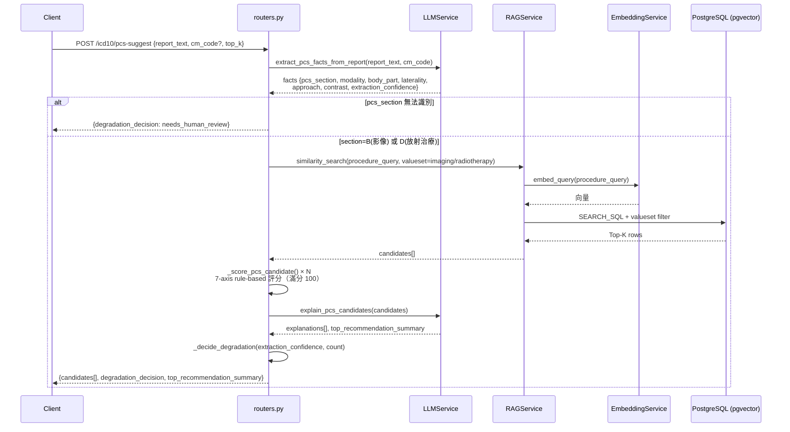

# ICD-10 PCS 模組

影像與放射治療報告 → ICD-10-PCS 代碼建議服務。

## Endpoints

| Method | Path | 說明 |
|---|---|---|
| POST | `/icd10/pcs-suggest` | 單份報告 → PCS 代碼建議 |
| POST | `/icd10/pcs-suggest/batch` | 批次處理（各筆獨立，單筆失敗不中斷） |
| GET | `/icd10/stats` | 知識庫統計 |

---

## /pcs-suggest 流程

---

## 7-axis 評分規則

ICD-10-PCS 代碼為 7 碼，每個 axis 獨立評分，滿分合計 100。

| Axis | 滿分 | 評分邏輯 |
|---|---|---|
| 1 Section | 15 | LLM 萃取的 pcs_section 是否吻合 |
| 2 Body System | 20 | LLM 萃取的 pcs_body_system 是否吻合 |
| 3 Root Operation | 25 | 影像：modality→root type；手術：modality→root op set |
| 4 Body Part | 25 | RAG 排名 rank-based（25/20/15/10/5/...），左右側錯誤 -8 |
| 5 Approach/Contrast | 15 | 影像：contrast yes/no；手術：approach type |

---

## valueset 分層過濾

`embed_icd10.valueset` 欄位將代碼分為三類，搜尋時自動依 pcs_section 篩選：

| pcs_section | valueset | 說明 |
|---|---|---|
| B | `imaging` | 影像診斷（X-Ray, CT, MRI, Ultrasound, Fluoroscopy） |
| D | `radiotherapy` | 放射治療 |
| 其他 | — | 無法對應 → 直接回傳 `needs_human_review` |

**valueset 更新腳本**：[script/icd10/update_valueset.py](../../script/icd10/update_valueset.py)

---

## degradation 決策

| extraction_confidence | candidates 數 | decision |
|---|---|---|
| any | 0 | `needs_human_review` |
| high | > 0 | `use_pcs` |
| medium | > 0 | `loinc_fallback`（建議暫填 LOINC 18748-4） |
| low | > 0 | `needs_human_review` |
