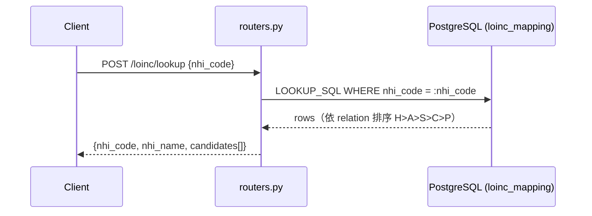
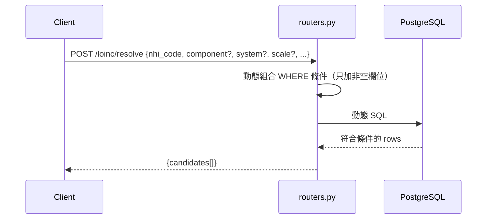
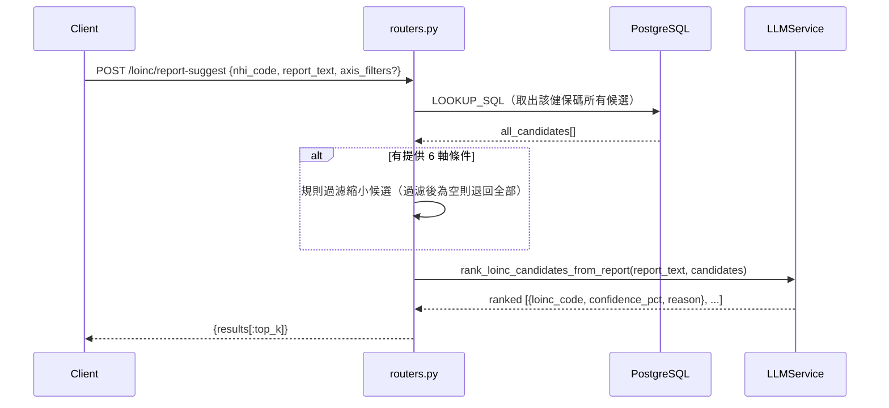

# LOINC 模組

健保碼 → LOINC 代碼對照服務，支援規則查詢與 AI 報告推估。

## Endpoints

| Method | Path | 說明 |
|---|---|---|
| POST | `/loinc/lookup` | 健保碼 → 所有候選 LOINC（依關聯程度排序） |
| POST | `/loinc/resolve` | 健保碼 + 6 軸條件精確篩選 |
| POST | `/loinc/report-suggest` | 健保碼 + 報告文字 → AI 推估最佳 LOINC |
| GET | `/loinc/stats` | 知識庫統計 |

---

## /lookup 流程

---

## /resolve 流程

---

## /report-suggest 流程（含 LLM）

---

## LOINC 6 軸（6-axis 結構）

| 軸 | 欄位 | 說明 |
|---|---|---|
| 1 | component | 測量對象（如 Glucose、Hemoglobin） |
| 2 | property | 測量性質（如 MCnc、Presence） |
| 3 | time_aspect | 時間點（如 Pt、24H） |
| 4 | system | 採樣來源（如 Ser/Plas、Urine） |
| 5 | scale | 量測尺度（如 Qn、Ord、Nom） |
| 6 | method | 方法（如 Enzymatic、Microscopy） |

---

## relation 排序規則

健保碼與 LOINC 的對應關聯程度，優先度 H > A > S > C > P：

| relation | 意義 |
|---|---|
| H | 完全對應（Homogeneous） |
| A | 近似對應（Approximate） |
| S | 子集（Subset） |
| C | 合併（Compound） |
| P | 部分（Partial） |

---

## 適用情境說明

| 情境 | 建議 endpoint |
|---|---|
| 已知健保碼，要看有哪些 LOINC 對應 | `/lookup` |
| 已知健保碼且已知部分 6 軸資訊 | `/resolve` |
| 已知健保碼且有實際報告文字 | `/report-suggest` |
| 純診斷印象 / ICD-10 摘要 | 不適用本模組（改用 SNOMED CT） |
