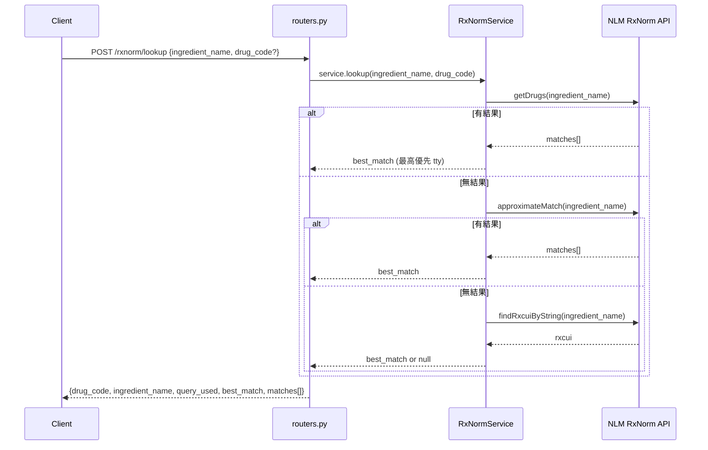
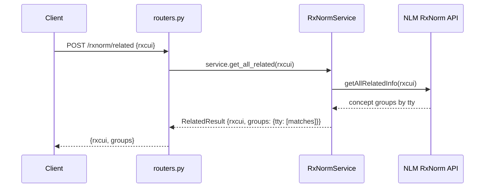

# RxNorm 模組

藥品成分名稱 → RxCUI 查詢服務，代理 NLM RxNorm REST API。

> 本模組不使用本地 DB，所有查詢都即時呼叫 NLM 外部 API（`rxnav.nlm.nih.gov`）。

## Endpoints

| Method | Path | 說明 |
|---|---|---|
| POST | `/rxnorm/lookup` | 藥品成分名 → RxCUI（多策略依序嘗試） |
| POST | `/rxnorm/approximate` | 模糊比對藥名 |
| POST | `/rxnorm/drugs` | 用成分名列出所有相關藥品（含劑型、劑量） |
| POST | `/rxnorm/related` | 查 RxCUI 完整關係樹 |
| GET | `/{rxcui}/properties` | RxCUI 基本屬性 |
| GET | `/{rxcui}/all-properties` | RxCUI 所有屬性（含 ATC、SNOMED 跨碼） |
| GET | `/{rxcui}/ndcs` | 用 RxCUI 查 NDC 碼 |
| GET | `/spelling/{name}` | 藥名拼字建議 |

---

## /lookup 流程（多策略容錯）

---

## /related 流程

---

## RxNorm TTY（術語類型）說明

| TTY | 說明 |
|---|---|
| IN | Ingredient（成分，最常用） |
| PIN | Precise Ingredient（精確成分） |
| MIN | Multiple Ingredients |
| BN | Brand Name（品牌名） |
| SBD | Semantic Branded Drug（含劑量品牌） |
| SCD | Semantic Clinical Drug（含劑量成分） |
| GPCK | Generic Pack |
| BPCK | Brand Pack |

---

## 注意事項

- 所有請求都即時打外部 API，網路異常會直接失敗
- `RxNormService` 有設 `delay=0.1` 避免打太快被 NLM 限速
- RxNorm 資料來源為美國 FDA，台灣未上市藥品可能查無結果
