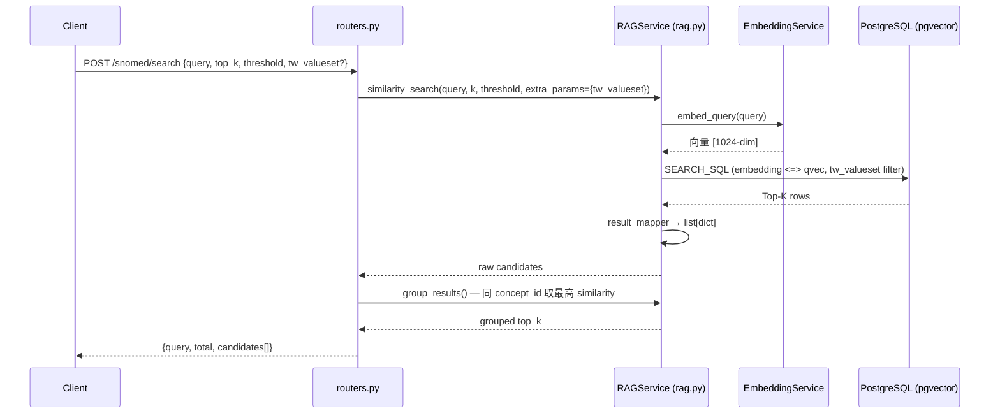
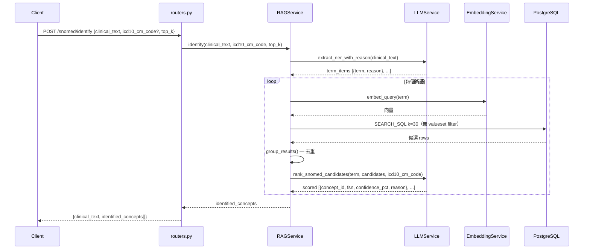

# SNOMED CT 模組

台灣 TWCore IG 的 SNOMED CT 概念識別與向量搜尋服務。

## 檔案結構

| 檔案 | 說明 |
|---|---|
| [models.py](models.md) | SQLAlchemy ORM：documents、document_embeddings |
| [schemas.py](schemas.md) | Pydantic request / response schema |
| [routers.py](routers.md) | FastAPI endpoints：/search、/identify、/stats |
| [valuesets/](valuesets/) | TWCore IG ValueSet JSON（衛服部下載） |

---

## 整體流程

### /search — 向量搜尋

### /identify — 臨床文字 → SNOMED CT（含 LLM reranking）

---

## field_type 參數說明

`/identify` 接受選填的 `field_type`，前端依畫面上的欄位類型傳入，後端自動對應到 TWCore ValueSet 縮小搜尋範圍。**不傳則全庫搜尋。**

| field_type | 代表意義 | 對應 FHIR 欄位 |
|---|---|---|
| `diagnosis` | 臨床診斷、疾病、症狀 | Condition.code |
| `medication_route` | 用藥途徑（口服、靜脈注射...） | MedicationRequest.route |
| `department` | 醫療科別、專科 | PractitionerRole.specialty |
| `profession` | 醫事人員職類（醫師、護理師...） | Practitioner.qualification |

---

## tw_valueset 過濾層

搜尋前用 `tw_valueset` 欄位縮小候選範圍，對應台灣 TWCore IG ValueSet：

| tw_valueset | 對應 FHIR 情境 | 標記規則 |
|---|---|---|
| `condition` | Condition.code | semantic_tag IN (finding, disorder, situation, event) |
| `medical-department` | PractitionerRole.specialty | 明確 46 個 SNOMED code |
| `medication-path` | MedicationRequest.route | 明確 17 個 code + qualifier value 含 "route" |
| `health-professional` | Practitioner.qualification | semantic_tag = occupation + 明確 20 個 code |
| `NULL` | 不限制 | 其餘概念 |

**tw_valueset 標記腳本**：[script/snomed/update_valueset.py](../../script/snomed/update_valueset.py)

---

## 設計決策

**為什麼不在搜尋前做 classification？**

SNOMED CT 是階層結構，搜尋 "hypertension" 時 Clinical finding、Hypertension、Essential hypertension 三者相似度都高。做 pre-classification 成本高（需要額外 LLM call 或分類模型），且醫院端硬體規格有限。

現行做法：
1. **tw_valueset filter**（前段粗篩）—— caller 知道填哪個 FHIR 欄位，傳入對應 valueset
2. **LLM reranking**（後段精選）—— 從縮小後的候選集選最精確的顆粒度

兩步加起來等同 pre-classification + selection，但不需要額外模型。
