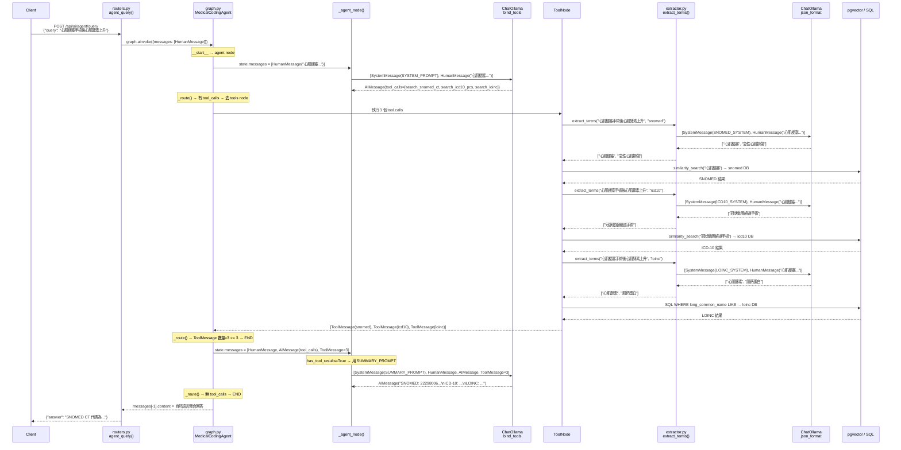
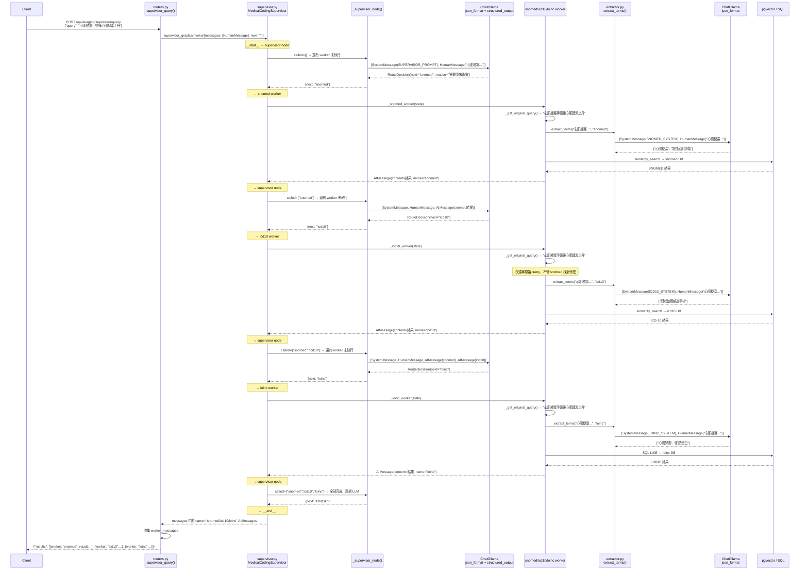

## ReAct：LLM 看到上一個工具的結果，才決定下一步
### ReAct /api/ai/agent/query

## Supervisor：Worker 全部只看原始輸入，互相不知道彼此的結果

### Supervisor /api/ai/agent/supervisor/query

---
### 兩個架構做的事幾乎一樣，差異只有：
1. ReAct 最後多一次 LLM call 把結果整理成自然語言，Supervisor 直接回 JSON
2. ReAct 的 LLM 理論上可以根據前一個工具的結果調整下一個查詢，但現在程式碼裡 extractor 收到的都是原始 query，所以實際上也沒有做到

#### 這個專案裡：

|名詞|是什麼|例子|
|---|---|---|
|Tool|一個 Python 函式，@tool 裝飾| search_snomed_ct()|
|Agent|有 LLM 在做決策的 node  |ReAct 的 agent node、Supervisor node|
|Worker|Supervisor 裡的執行 node，沒有 LLM，直接呼叫 tool|_snomed_worker()|

1. ReAct 只有一個 Agent（一個 LLM）加上三個 tool。不是三個 agent。
2. Supervisor 有一個 Agent（Supervisor LLM）加上三個 worker，worker 裡面呼叫 tool，worker 本身不是 agent。