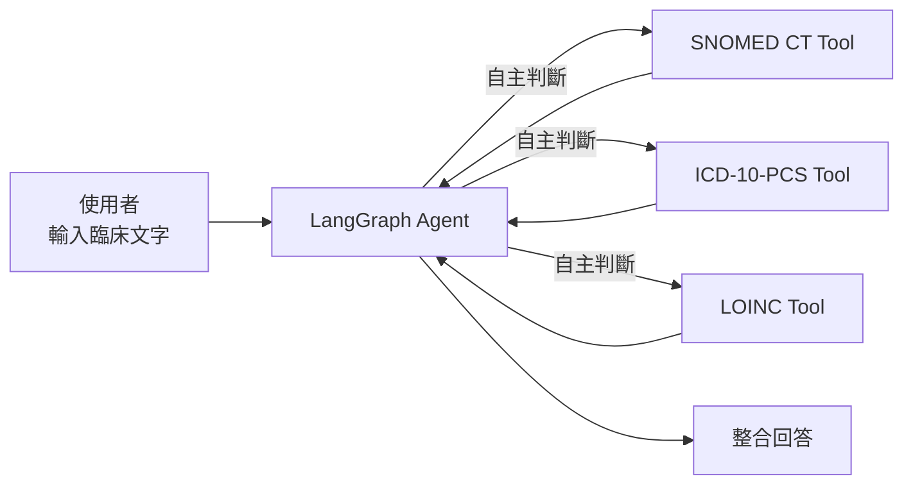
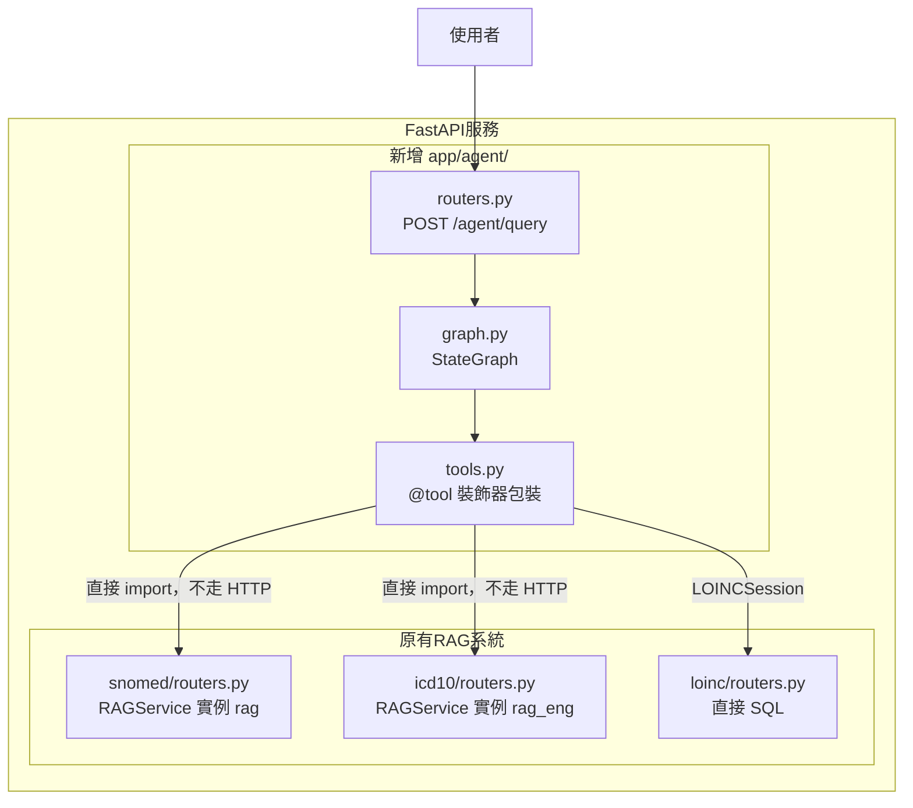
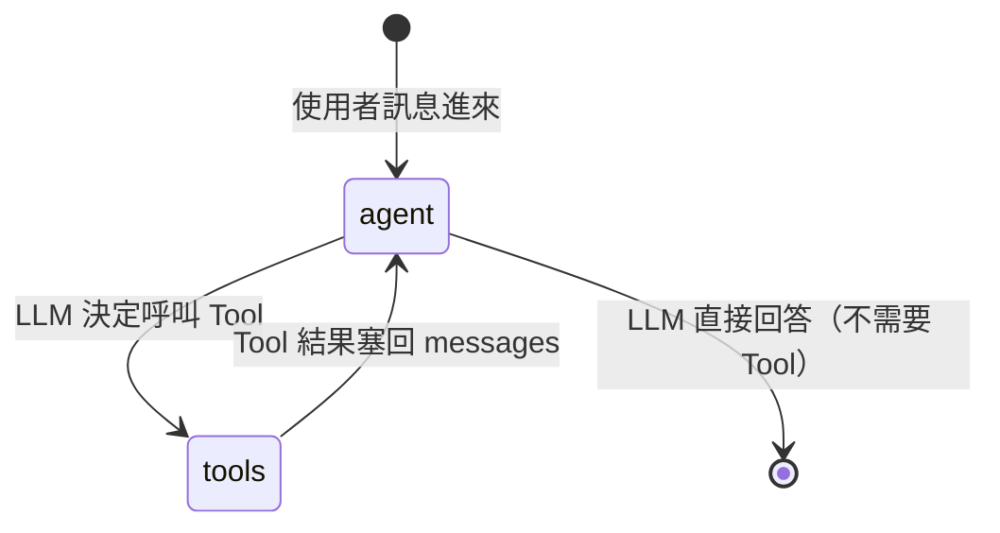
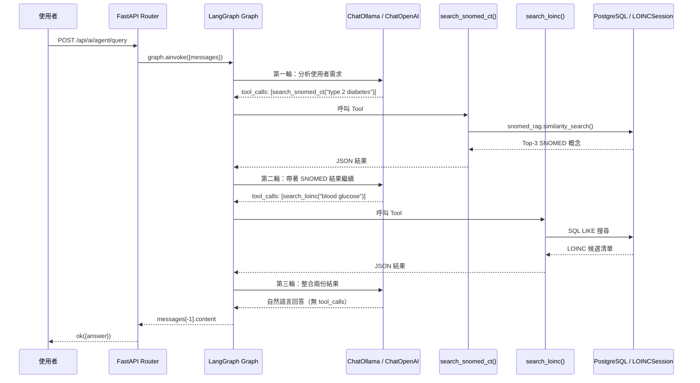
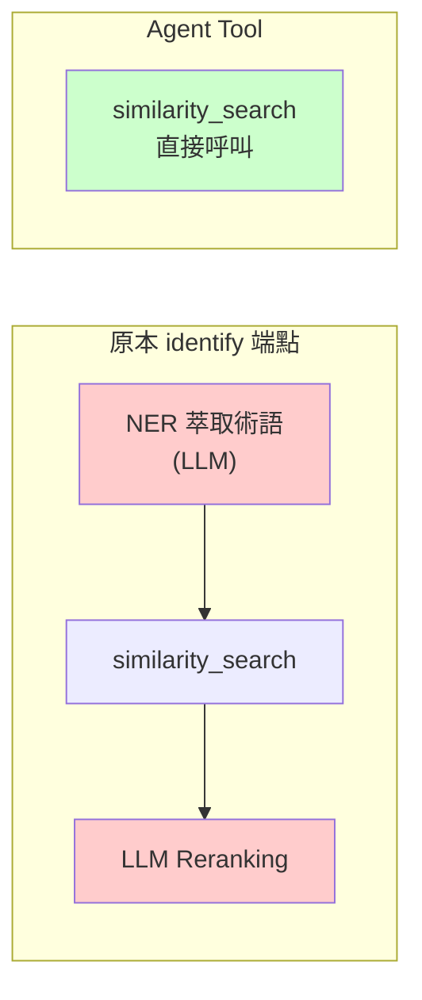
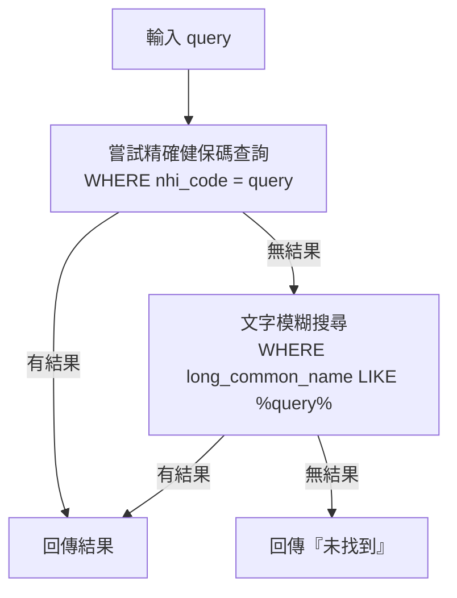
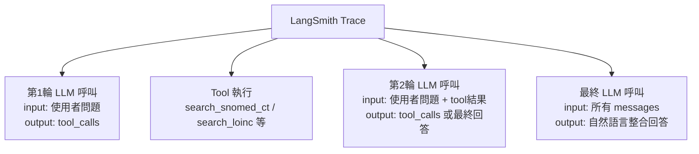
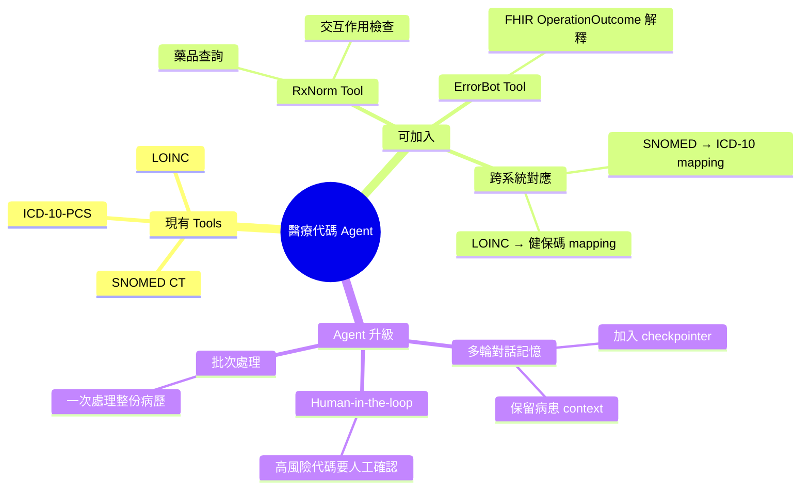

# LangGraph 醫療代碼 Agent 筆記

> 記錄我把現有的 RAG 醫療代碼系統改造成 LangGraph AI Agent 的過程與設計構想。

---

## 背景：我原本有什麼

我的系統是一個 FastAPI 服務，整合了四個醫療代碼系統。每個系統都是獨立的 RAG pipeline，使用者要自己知道去打哪個 API：

| 系統 | 端點 | 怎麼搜尋 |
|---|---|---|
| SNOMED CT | `/api/ai/snomed/identify` | 文字 → embedding → pgvector |
| ICD-10-PCS | `/api/ai/icd10/suggest` | 文字 → embedding → pgvector |
| LOINC | `/api/ai/loinc/lookup` | 健保碼 → SQL |
| RxNorm | `/api/ai/rxnorm/lookup` | 呼叫外部 NLM API |

問題是：**使用者必須自己判斷要查哪個系統**，而且無法跨系統問問題。

---

## 目標：Agent 自己決定要查什麼

我想要的是：輸入一段臨床文字，Agent 自己判斷要查 SNOMED、ICD-10 還是 LOINC，然後把結果整合起來回答。



---

## 架構設計

### 整體系統架構

我沒有動原本的 RAG 系統，只是在外面加了一層 Agent。



### LangGraph StateGraph

這是 Agent 的核心，一個簡單的兩節點狀態機：



用 LangGraph 程式碼表達：

```python
graph = (
    StateGraph(MessagesState)
    .add_node("agent", _agent)          # LLM 思考節點
    .add_node("tools", ToolNode(...))   # 執行 Tool 節點
    .add_edge("__start__", "agent")
    .add_conditional_edges("agent", _route)
    .add_edge("tools", "agent")         # Tool 完成 → 回 LLM
    .compile()
)
```

---

## 一次查詢的完整流程

以「第二型糖尿病需要 SNOMED 和血糖 LOINC 代碼」為例：



---

## Tool 的設計細節

### 為什麼 Tool 不呼叫 identify()？

原本的 `/snomed/identify` 端點內部流程是：

```
identify() = NER萃取術語 → similarity_search → LLM reranking
```

Agent 本身就是「思考要查什麼」的角色，所以 Tool 只需要做 `similarity_search()`，不需要再跑一次 NER。



紅色的部分在 Agent 架構下不需要，Agent 的 LLM 本身就在做這件事。

### LOINC Tool 的特殊處理

LOINC 沒有向量搜尋，只有 `健保碼 → LOINC` 的對照表。所以 LOINC tool 做了兩段式查詢：



---

## LangSmith 監控

打開 LangSmith 之後，每次 `/agent/query` 都會出現完整的 trace：



設定方式：在 `.env` 加入：

```env
LANGCHAIN_TRACING_V2=true
LANGCHAIN_API_KEY=lsv2_pt_xxxxxx
LANGCHAIN_PROJECT=medical-coding-agent
```

---

## 未來可以擴充的方向



---

## 檔案位置速查

```
app/
├── agent/
│   ├── tools.py     ← @tool 定義，docstring 決定 Agent 路由邏輯
│   ├── graph.py     ← StateGraph + LLM 初始化 + LangSmith 橋接
│   └── routers.py   ← POST /api/ai/agent/query
├── snomed/routers.py  ← rag 實例（被 tools.py import）
├── icd10/routers.py   ← rag_eng 實例（被 tools.py import）
└── config.py          ← 新增 langchain_* 設定欄位
```
